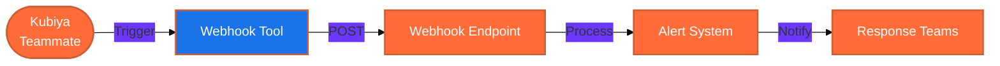

#  Webhook Tools for Kubiya

<div align="center">

> 🔔 Send alerts and notifications with Kubiya automation

[](https://chat.kubiya.ai)
[](https://en.wikipedia.org/wiki/Webhook)
[](https://www.docker.com)

</div>

## 🎯 Overview

This module provides a webhook tool for sending alerts and notifications through Kubiya. Built on Docker containers and leveraging the power of the Kubiya platform, this tool enables seamless integration with your monitoring and alerting systems.

## 🏗️ How It Works



## ✨ Key Features

<table>
<tr>
<td width="50%">

### 🚨 Alert Notifications
- Send SQS queue alerts
- Customizable alert payloads
- Timestamp and region tracking
- Service and queue identification

</td>
<td width="50%">

### 🔄 Integration
- HTTP POST requests
- JSON payload formatting
- Response handling
- Error management

</td>
</tr>
<tr>
<td width="50%">

### 📊 Monitoring
- AWS service monitoring
- Queue lag detection
- Performance tracking
- System health checks

</td>
<td width="50%">

### 🔍 Traceability
- User identification
- AWS profile tracking
- Log bucket references
- Honeycomb dataset integration

</td>
</tr>
</table>

## 📋 Prerequisites

<table>
<tr>
<td width="120" align="center">

<br/>Webhooks
</td>
<td>

- Webhook endpoint URL
- HTTP POST access
- JSON payload support
- Response handling

</td>
</tr>
<tr>
<td width="120" align="center">

<br/>Docker
</td>
<td>

- Docker runtime
- Container access
- Network connectivity
- cURL capabilities

</td>
</tr>
</table>

## 🚀 Quick Start

### 1️⃣ Install Tools

1. Visit [chat.kubiya.ai](https://chat.kubiya.ai)
2. Navigate to teammate settings
3. Install Webhook tools source
4. Configure access

### 2️⃣ Start Using

Example commands:
```
"Send alert notification"
"Trigger webhook for queue lag"
"Notify about system issue"
```

## 📚 Learn More

<table>
<tr>
<td width="33%" align="center">

[](https://docs.kubiya.ai)

</td>
<td width="33%" align="center">

[](https://en.wikipedia.org/wiki/Webhook)

</td>
<td width="33%" align="center">

[](https://kubiya.ai/community)

</td>
</tr>
</table>

---

<div align="center">

Built with ❤️ by the [Kubiya Community](https://chat.kubiya.ai)


</div> 